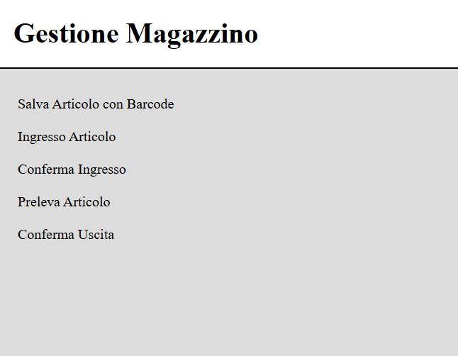
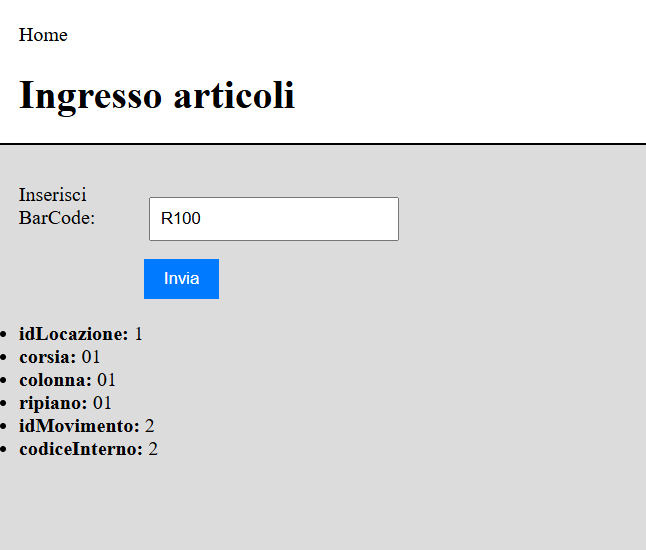
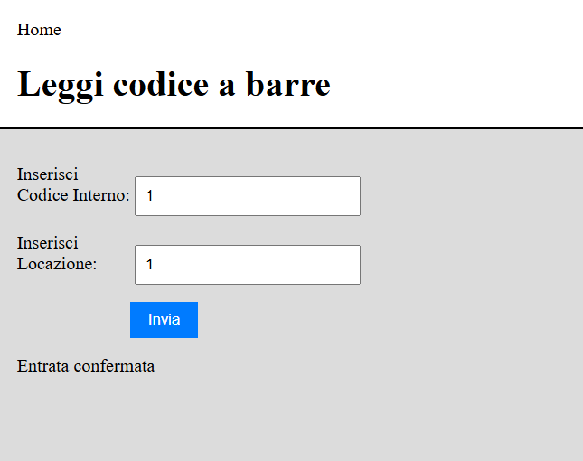

# 📦 Magazzino Resistenze

Applicazione web **full-stack** per la gestione di un magazzino di componenti elettronici (resistenze): censimento degli articoli tramite barcode, assegnazione automatica della posizione, movimenti di entrata e uscita con conferma dell'operatore.

Progetto finale del corso IFTS *Tecniche di programmazione Java, Android e Web per l'Industria 5.0* – ITS Academy Angelo Rizzoli (2025).



## ✨ Funzionalità
- **Anagrafica articoli**: registrazione di ogni tipo di resistenza con descrizione e barcode
- **Assegnazione automatica della posizione**: all'ingresso il sistema sceglie la locazione (corsia/colonna/ripiano) in base all'occupazione del magazzino e, se è piena, ne trova una alternativa
- **Tracciamento per singola confezione**: ogni confezione riceve un codice interno univoco, per evitare errori tra prodotti facili da confondere
- **Entrate e uscite con conferma**: l'operatore conferma ogni movimento indicando codice interno e locazione
- **Viste SQL aggregate** per le giacenze e l'occupazione delle locazioni

| Ingresso di un articolo | Conferma del movimento |
|---|---|
|  |  |

## 🛠️ Stack
| Livello | Tecnologie |
|---|---|
| Frontend | HTML, CSS, JavaScript (Fetch API) |
| Backend | Java 17, Spring Boot 3.5, Spring MVC, Lombok, Maven |
| Persistenza | MySQL 8.4, JDBC |
| Strumenti | Git, GitHub, Postman, VS Code, MySQL Workbench |

## 🏗️ Architettura
Applicazione client-server con API REST e architettura a tre livelli:
- **Controller** – gestione delle richieste HTTP ed esposizione degli endpoint REST
- **Service** – logica di business (assegnazione delle locazioni, conferme dei movimenti)
- **Data layer** – libreria `magazzino-db` indipendente da Spring, basata su JDBC, con `PreparedStatement` (protezione da SQL injection) e try-with-resources

```
magazzino-resistenze/
├── magazzino-db/    # libreria Java di accesso ai dati (JDBC)
├── magazzino-api/   # applicazione Spring Boot: API REST + pagine web
├── database/        # script SQL di creazione del database
└── docs/            # relazione del progetto e screenshot
```

## 🔌 Endpoint principali
| Metodo | Endpoint | Descrizione |
|---|---|---|
| POST | `/barcode` | Registra un nuovo articolo |
| POST | `/movimenti/entrata` | Assegna una locazione a un articolo in ingresso |
| PUT | `/movimenti/entrata/conferma` | Conferma un'entrata |
| GET | `/movimenti/entrata` | Elenco delle entrate da confermare |
| PUT | `/movimenti/uscita` | Registra un prelievo |
| PUT | `/movimenti/uscita/conferma` | Conferma un'uscita |
| GET | `/movimenti/uscita` | Elenco delle uscite da confermare |

## 🚀 Avvio in locale
**Requisiti:** Java 17 o superiore, MySQL 8.4. Maven non serve: viene scaricato automaticamente dal wrapper `mvnw`.

**1. Crea il database** eseguendo lo script [`database/schema.sql`](database/schema.sql) (da MySQL Workbench oppure con il client `mysql` come utente amministratore).

**2. Crea un utente dedicato all'applicazione**, con i soli permessi necessari:
```sql
CREATE USER 'magazzino_app'@'localhost' IDENTIFIED BY 'scegli_una_password';
GRANT SELECT, INSERT, UPDATE, DELETE ON magazzinoresistenza.* TO 'magazzino_app'@'localhost';
```

**3. Inserisci le locazioni del magazzino** (l'applicazione le usa per assegnare le posizioni):
```sql
INSERT INTO magazzinoresistenza.locazioni (corsia, colonna, ripiano) VALUES
('01','01','01'), ('01','01','02'), ('01','02','01'), ('01','02','02'),
('02','01','01'), ('02','01','02'), ('02','02','01'), ('02','02','02');
```

**4. Configura la connessione:** copia `magazzino-api/src/main/resources/application.properties.example` in `application.properties` nella stessa cartella e inserisci utente e password scelti al punto 2.

**5. Installa la libreria di accesso ai dati:**
```
cd magazzino-db
./mvnw install          # su Windows: .\mvnw.cmd install
```

**6. Avvia l'applicazione:**
```
cd ../magazzino-api
./mvnw spring-boot:run  # su Windows: .\mvnw.cmd spring-boot:run
```

**7.** Apri **http://localhost:8080**

## 🧭 Come si usa
1. **Salva articolo**: registra un tipo di resistenza con descrizione e barcode
2. **Ingresso articolo**: inserisci il barcode; l'app assegna una locazione e un codice interno alla confezione
3. **Conferma ingresso**: conferma con codice interno e ID della locazione
4. **Preleva articolo** e **Conferma uscita**: stesso procedimento per l'uscita dal magazzino

## 🔭 Possibili sviluppi
- Autenticazione e accesso alle API solo per utenti autorizzati
- Hashing delle password con BCrypt (attualmente MD5)
- Gestione delle connessioni con un connection pool e accesso ai dati tramite gli strumenti di Spring
- Test automatici (JUnit) e logging strutturato al posto di `System.out`
- Paginazione e ricerca avanzata nelle API
- Nuovo frontend in React e client Android

## 📄 Documentazione
La relazione completa del progetto (analisi, modello E-R, architettura, scelte implementative) è in [`docs/relazione.pdf`](docs/relazione.pdf).

## 👤 Autore
**Francesco Esposito** – [LinkedIn](https://www.linkedin.com/in/francesco-esposito-42a458179) · [GitHub](https://github.com/francescoesposito-geeks)